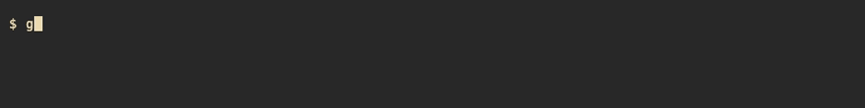
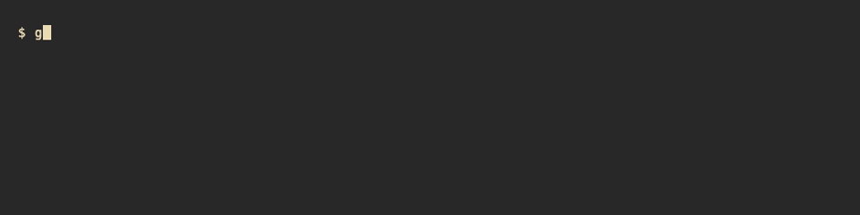

# glyphling

[](https://github.com/RR-AMATOK/Claude-Hatch/actions/workflows/ci.yml)
[](./LICENSE)
[](./package.json)

> A tiny companion that grows with your code.

<p align="center">
  
</p>

```
   /[o-o]\
   +=|--|=+
   Pixel   · Lv 12  · [#######       ] · 420 XP
```

**glyphling** is a CLI companion that lives inside your Claude Code window. Hatch one from four different eggs, then watch it grow as you work — every commit, test, token, and file you touch feeds experience to your pet. It reacts to your streaks, picks up a personality from the languages you use, and is always just one glance away at the bottom of your terminal.

It's a small reward loop for something you already do: write code.

---

## Quick start

```bash
npm install -g glyphling
glyphling
```

<p align="center">
  
</p>

Pick an egg. Name your pet. That's it — everything after is earned.

---

## Lives in Claude Code

Drop this into `.claude/settings.json` and your pet moves into the Claude Code statusline. One line, two lines when there's something to say, zero configuration.

```json
{
  "statusLine": {
    "type": "command",
    "command": "glyphling statusline",
    "padding": 1,
    "refreshInterval": 1
  }
}
```

<p align="center">
  
</p>

The compact renderer reads state in under 30 milliseconds. No subprocess you'll ever feel.

Your pet **wanders** in the statusline at standard and wide terminal widths — one cell per second, bouncing at the edges. The expanded TUI shows the same wander at 2 Hz inside its own 40-column arena. Pet pauses center-stage during eating, playing, level-ups, and other one-shot moments so the animation reads as a deliberate beat. `NO_MOTION=1` or `GLYPHLING_REDUCED_MOTION=1` pin the pet still.

---

## Slash commands in Claude Code

Once your pet is in the statusline, you can feed it, check on it, and manage it directly from the Claude Code chat using slash commands — without leaving the conversation.

**Install the slash commands once:**

```bash
glyphling install
```

This copies ten `glyph-*.md` files into `~/.claude/commands/`. They are immediately available as `/glyph-feed`, `/glyph-status`, etc. in any Claude Code session.

**Available slash commands:**

| Command | What it does |
|---------|-------------|
| `/glyph-hatch <egg-type> [name]` | Hatch a new egg (first run) |
| `/glyph-feed [note]` | Feed your pet |
| `/glyph-pet [note]` | Scritch your pet |
| `/glyph-play [note]` | Play a round with your pet |
| `/glyph-pause` | Pause the neglect clock (going away for a while) |
| `/glyph-resume` | Resume after a pause |
| `/glyph-name <new-name>` | Rename your pet |
| `/glyph-status` | Show a compact status summary |
| `/glyph-pets` | List all your pets |
| `/glyph-doctor` | Run diagnostics |

Mutating commands (`hatch`, `feed`, `pet`, `play`, `pause`, `resume`, `name`) use `disable-model-invocation: true` so they run directly without spawning an LLM context. Read-only commands (`status`, `pets`, `doctor`) can also be invoked by the model.

**To remove the slash commands:**

```bash
glyphling install --uninstall
```

This removes only the glyphling-managed files — any other files in `~/.claude/commands/` are untouched.

Note: `glyphling install` does **not** touch `~/.claude/settings.json`. The statusline snippet above must be added manually (or run `glyphling setup` once it ships).

---

## The four eggs

Each egg hatches into a different lineage. The species you pick shapes your pet's silhouette, its accent colour, and the small effects it throws off while idling.

```
   circuit          rune            shard           bloom

   .--[o.o]--.    .-<o.o>-.        /\o.o/\       (o.o)
   |+|=||=|+|    `=|---|='         \/___\/       \==/
   '--+--+--'      `-'--'           ~  ~         //\\
```

- **circuit** — lattice kin. Reads as built, not born. Throws off sparks when it's pleased.
- **rune** — arcane script made flesh. Speaks in glyphs the moment it hatches.
- **shard** — a little crystalline thing. Catches the light.
- **bloom** — half-creature, half-garden. Grows quieter, stranger.

There's no "best" egg. None of them are rarer than the others. Pick the one that looks right to you.

---

## It cares what you do

Your pet watches the same signals you do — commits land, tests pass, tokens fly — and responds in real time.

<p align="center">
  
  
  
</p>

- **commits** → a small meal
- **tests passing** → a celebration
- **tokens flowing** → a brief sparkle (`\ * * /`)
- **a long streak** → a sparkle trail
- **a fix after an error** → a visible sigh of relief
- **hours on a hard problem** → it falls asleep next to you

Neglect it and it slows down, gets quiet, then sick. The clock is honest: pause when you're away, resume when you're back. No freemium tricks, no gacha, no countdown timers designed to hurt.

---

## Personality from your code

Two pets of the same species are never the same. Your pet's temperament is a blend of eight traits — `Stoic`, `Friendly`, `Pragmatic`, `Energetic`, `Gruff`, `Philosophical`, `Paranoid`, `Curious` — and the blend is computed from the real texture of your work: the languages you touch, the hours you keep, the rhythm of your commits, the way you interact with it.

A late-night Rust coder and a weekend Python poet can own the same egg and end up with visibly different pets. You'll see it in the idle animation it picks:

```
   idle-stoic         idle-chipper       idle-grumpy        idle-curious

   /[-_-]\           /[^o^]\            /[>_<]\            /[o.O]\
   +=|--|=+          +=|\/|=+           +=|__|=+            +=|--|=+
```

Your pet drifts. You will too.

---

## Share what you make

<p align="center">
  
</p>

```bash
glyphling export 1
```

Unlocks a short, watermarked snapshot of your pet. Drop it in a README, a tweet, a pull request — wherever.

Higher tiers unlock later: sharper resolution, longer clips, cinematic moments. Something else waits at the top. We're not going to spoil it.

(GIF export shells out to [`vhs`](https://github.com/charmbracelet/vhs) — `brew install vhs` once, then it just works.)

---

## How far does it go?

A very, very long way.

<p align="center">
  
</p>

The level cap is deliberately, unreasonably distant — a number that a heavy everyday coder takes years to reach. A normal coder, longer than that. Most people will never see it, and that's fine; the point isn't to beat it. The point is that it's there, and every commit moves you a little closer. Each level along the way gets its own brief flash.

What happens when someone does reach the top is a surprise.

---

## Accessibility & settings

A handful of environment variables let you tune glyphling to your terminal and your preferences.

- `GLYPHLING_REDUCED_MOTION=1` — calmer, shorter animation variants. Level-up flashes and other flourishes are toned down without hiding the moment itself.
- `GLYPHLING_RICH_GLYPHS=1` — opt into emoji mood glyphs instead of ASCII. Off by default because emoji cell width is unreliable across terminals.
- `GLYPHLING_TRUECOLOR=1` — opt into 24-bit colour. 256-colour is the default.
- `NO_256COLOR=1` — fall back to ANSI-16 for legacy terminals.
- `GLYPHLING_HOME=<path>` — override where state lives. Useful for trying glyphling without touching your real pet.

All are optional. The defaults are picked to be safe on the oldest terminals we could find.

---

## Philosophy

Three tenets. No exceptions.

1. **No dark patterns.** No energy meters that expire if you don't pay. No artificial scarcity. No push notifications. Your pet waits.
2. **No leaderboards.** glyphling is a personal companion, not a competitive product. Cheating mostly hurts yourself; we have some cheap integrity checks (hash-chained events, transcript cross-checks, sane daily caps) but we are not running a tournament.
3. **Your state, your machine.** Everything lives in `~/.claude/glyphling/` as plain JSON. No telemetry, no account, no network. If you delete the folder, your pet is gone — that's part of the contract.

---

## What's under the hood

- **Node.js 20+**, TypeScript (strict), Ink + React for the expanded TUI, a lock-free one-shot renderer for the statusline
- **Zero runtime network dependencies.** Everything is local files, an atomic write pattern, and a hybrid death-clock that's robust to clock skew and suspend/resume
- **GIF export** shells out to `vhs` — not an npm dependency; a one-time `brew install`
- **740 tests** across state, XP, lifecycle, animations, adoption, rendering, and export

For the full architecture, read [`docs/architecture.md`](docs/architecture.md). For the frame vocabulary, [`docs/design/compact-frames.md`](docs/design/compact-frames.md) and [`docs/design/expanded-frames.md`](docs/design/expanded-frames.md).

---

## Install and contribute

```bash
# from source
git clone https://github.com/RR-AMATOK/Claude-Hatch.git glyphling
cd glyphling
npm install
npm run dev    # launches the Ink TUI against ./.dev-state/dev
npm test       # 1217 tests
```

`v1.0.0` is shipped — `npm install -g glyphling` pulls the stable build. Contributions are welcome: open an issue first for anything substantial, and please keep PRs focused (one purpose per branch). Existing conventions live in `CLAUDE.md` and the agent-team docs.

---

## Support the project

glyphling is free, local-only, and will stay that way. If it makes your terminal a little warmer, you can buy me a coffee:

<p align="center">
  <a href="https://buymeacoffee.com/888t5ggdv6w"></a>
</p>

[buymeacoffee.com/888t5ggdv6w](https://buymeacoffee.com/888t5ggdv6w)

---

## License

MIT.

---

<p align="center"><sub>glyphling remembers.</sub></p>
